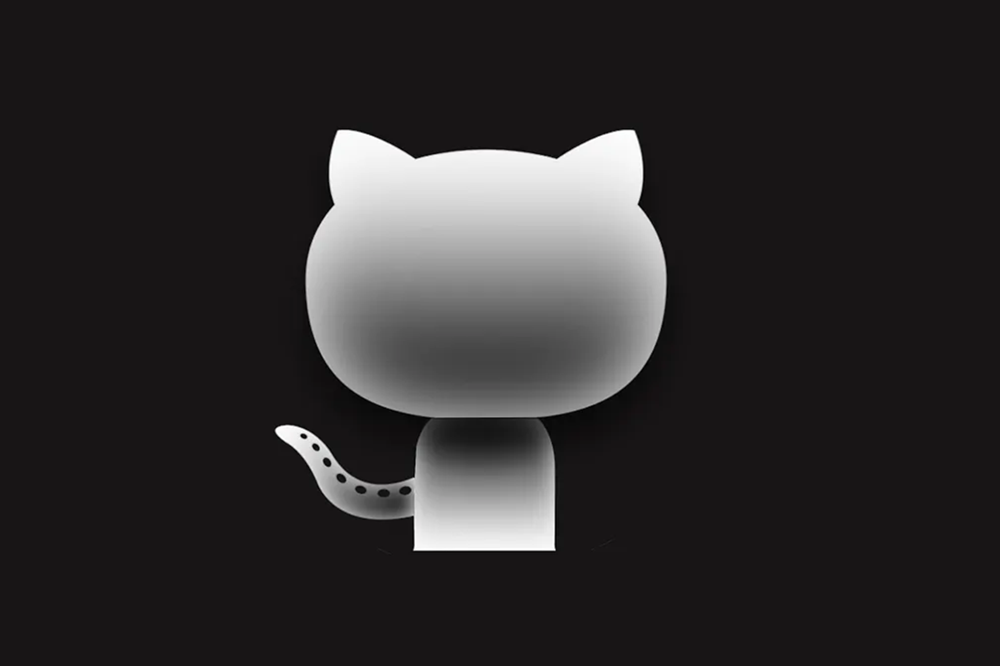
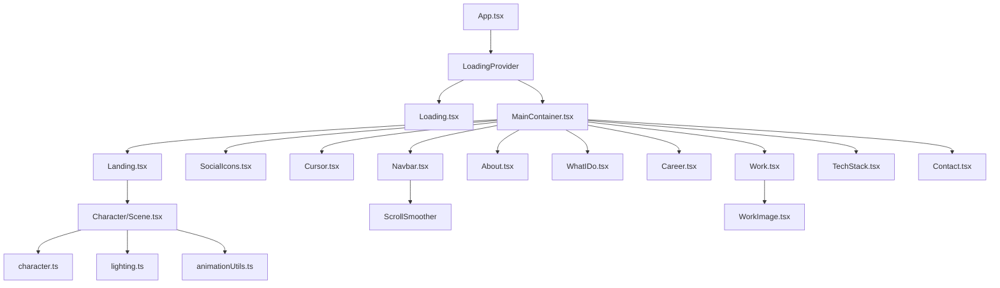

# Aryaman Raj Tiwari - Portfolio Website

[](https://www.typescriptlang.org/)
[](https://reactjs.org/)
[](https://threejs.org/)
[](https://vitejs.dev/)
[](https://gsap.com/)

🔗 **Repository:** [github.com/ShoaibAhmedSoomro/Shoaib-Ahmed-3D-Portfolio](https://github.com/ShoaibAhmedSoomro/Shoaib-Ahmed-3D-Portfolio)

A high-performance, interactive portfolio website featuring 3D character animations, smooth scroll effects, and modern web technologies. Built with React, TypeScript, Three.js, and GSAP.



---

## 🏷️ Topics / Keywords

```
react typescript threejs portfolio gsap vite three-fiber react-three-fiber web-development frontend 3d-portfolio interactive-portfolio developer-portfolio personal-website animations scroll-animations webgl javascript responsive-design nodejs fullstack-developer
```

---

## 🌟 Features

- **Interactive 3D Character** - Animated character model that responds to mouse/touch movements and follows scroll position
- **Smooth Scroll Experience** - GSAP ScrollSmoother provides butter-smooth scrolling with scroll-triggered animations
- **Horizontal Scroll Section** - Work portfolio section with horizontal scrolling effect
- **Physics-Based Tech Stack** - Interactive 3D spheres with physics simulation using React Three Fiber and Rapier
- **Dynamic Loading Screen** - Engaging loading experience with animated elements and progress tracking
- **Text Animations** - SplitText-powered character and word animations
- **Custom Cursor** - Enhanced cursor with magnetic effects on interactive elements
- **Responsive Design** - Fully responsive across desktop, tablet, and mobile devices
- **SEO Optimized** - Meta tags and semantic HTML for search engine visibility

---

## 🏗️ Architecture Overview

```
Portfolio-Website/
├── public/                     # Static assets
│   ├── images/                 # Image assets (logo, tech icons, placeholders)
│   ├── models/                 # 3D model files (.glb, .hdr)
│   ├── draco/                  # Draco decoder for compressed 3D models
│   └── resume/                 # Downloadable resume PDF
├── src/
│   ├── components/             # React components
│   │   ├── Character/          # 3D character scene and utilities
│   │   ├── styles/             # Component-specific CSS files
│   │   └── utils/              # Animation and scroll utilities
│   ├── context/                # React context providers
│   ├── data/                   # Static data files
│   └── assets/                 # Additional assets
├── index.html                  # HTML entry point
├── vite.config.ts              # Vite configuration
└── package.json                # Dependencies and scripts
```

---

## 📦 Component Breakdown

### Core Components

| Component | Purpose | Key Dependencies |
|-----------|---------|------------------|
| `App.tsx` | Root component, sets up providers and lazy loading | LoadingProvider |
| `MainContainer.tsx` | Main layout wrapper, renders all sections in order | All section components |
| `LoadingProvider.tsx` | Context provider for loading state management | React Context |

### Section Components

| Component | Purpose | Key Features |
|-----------|---------|--------------|
| `Landing.tsx` | Hero section with name and role display | Text loop animations |
| `About.tsx` | Personal introduction section | SplitText animations |
| `WhatIDo.tsx` | Skills showcase (Frontend & Backend) | Interactive skill cards |
| `Career.tsx` | Work experience timeline | Animated timeline with dots |
| `Work.tsx` | Portfolio projects with horizontal scroll | GSAP ScrollTrigger pinning |
| `TechStack.tsx` | Interactive 3D tech spheres | React Three Fiber, Rapier physics |
| `Contact.tsx` | Contact information and social links | Dynamic copyright year |

### UI Components

| Component | Purpose |
|-----------|---------|
| `Navbar.tsx` | Fixed navigation with smooth scroll links |
| `Loading.tsx` | Loading screen with progress and welcome animation |
| `Cursor.tsx` | Custom cursor with magnetic effect |
| `SocialIcons.tsx` | Floating social media icons with resume download |
| `HoverLinks.tsx` | Animated hover effect for navigation links |
| `WorkImage.tsx` | Project image container with video support |

### 3D Character System

| File | Purpose |
|------|---------|
| `Character/Scene.tsx` | Main Three.js scene setup and render loop |
| `Character/utils/character.ts` | Character model loading (GLTF) |
| `Character/utils/lighting.ts` | Scene lighting configuration |
| `Character/utils/animationUtils.ts` | Character animation mixer |
| `Character/utils/mouseUtils.ts` | Mouse/touch input handling for head tracking |
| `Character/utils/resizeUtils.ts` | Responsive canvas resizing |

### Animation Utilities

| File | Purpose |
|------|---------|
| `utils/GsapScroll.ts` | Scroll-triggered animations for character and sections |
| `utils/splitText.ts` | Text splitting and reveal animations |
| `utils/initialFX.ts` | Initial page load animations |

---

## 🔄 Data Flow & Processing

### Loading Sequence

```
1. App.tsx renders LoadingProvider
   └── LoadingProvider shows Loading.tsx
       └── Scene.tsx starts loading 3D model
           └── setProgress() tracks loading percentage
               └── When 100%, triggers initialFX()
                   └── Plays intro animations
                       └── Sets isLoading=false, hides loader
```

### Scroll Animation Pipeline

```
1. User scrolls page
   └── ScrollSmoother intercepts scroll (smooth: 1.7)
       └── ScrollTrigger detects section positions
           └── Timeline animations execute based on scroll progress
               ├── Character transforms (rotation, position)
               ├── Section opacity/transform changes
               └── Element stagger animations
```

### 3D Character Interaction

```
1. Mouse/Touch event detected
   └── handleMouseMove() normalizes coordinates
       └── handleHeadRotation() calculates target rotation
           └── THREE.MathUtils.lerp() smooths movement
               └── Bone rotation applied each frame
```

---

## 🔗 Component Relationships



---

## ⚙️ Key Dependencies

| Package | Version | Purpose |
|---------|---------|---------|
| `react` | ^18.3.1 | UI framework |
| `three` | ^0.168.0 | 3D graphics library |
| `@react-three/fiber` | ^8.17.10 | React renderer for Three.js |
| `@react-three/drei` | ^9.120.4 | Three.js helpers and abstractions |
| `@react-three/rapier` | ^1.5.0 | Physics engine for 3D |
| `gsap` | ^3.12.7 | Animation library (includes ScrollSmoother, SplitText - now free!) |
| `react-fast-marquee` | ^1.6.5 | Marquee text component |
| `react-icons` | ^5.3.0 | Icon library |

---

## 🚀 Getting Started

### Prerequisites

- Node.js 18+ 
- npm or yarn

### Installation

```bash
# Clone the repository
git clone https://github.com/ShoaibAhmedSoomro/Shoaib-Ahmed-3D-Portfolio.git

# Navigate to project directory
cd Shoaib-Ahmed-3D-Portfolio

# Install dependencies
npm install

# Start development server
npm run dev
```

### Available Scripts

| Script | Description |
|--------|-------------|
| `npm run dev` | Start development server with hot reload |
| `npm run build` | TypeScript compile + Vite production build |
| `npm run preview` | Preview production build locally |
| `npm run lint` | Run ESLint for code quality |

---

## 📁 Static Assets

### Images (`public/images/`)
- `logo.webp` - Site logo and favicon
- `react2.webp`, `next2.webp`, etc. - Tech stack sphere textures
- `placeholder.webp` - Project placeholder image

### 3D Models (`public/models/`)
- Character model (`.glb` format with Draco compression)
- Environment HDR for realistic lighting

### Resume (`public/resume/`)
- `Shoaib_Ahmed.pdf` - Downloadable resume

---

## 🎨 Styling Architecture

- **CSS Variables** - Global theming via `:root` variables
- **Component CSS** - Each component has dedicated `.css` file
- **Responsive Breakpoints**: 500px, 900px, 1024px, 1200px, 1400px, 1600px
- **Dark Theme** - Default dark color scheme (`--backgroundColor: #0b080c`)

---

## 🔧 Configuration Files

| File | Purpose |
|------|---------|
| `vite.config.ts` | Vite bundler configuration |
| `tsconfig.json` | TypeScript configuration |
| `eslint.config.js` | ESLint rules for code quality |
| `gsap-plugins.d.ts` | TypeScript declarations for GSAP premium plugins |

---

## 📈 Performance Optimizations

1. **Lazy Loading** - CharacterModel and MainContainer are lazy-loaded
2. **Suspense Boundaries** - Prevents layout shifts during loading
3. **Draco Compression** - 3D models compressed for faster loading
4. **WebP Images** - Optimized image format for faster loading
5. **Code Splitting** - Vite automatically splits chunks
6. **GPU Acceleration** - CSS transforms use `translateZ(0)`

---

## 🛠️ Recommendations for Improvement

### Performance
- [ ] Implement image lazy loading for Work section
- [ ] Add service worker for offline support
- [ ] Consider using `react-intersection-observer` for scroll-triggered lazy loading

### Features
- [ ] Add project detail modal/page
- [ ] Implement dark/light theme toggle
- [ ] Add blog section integration
- [ ] Implement contact form with backend

### Code Quality
- [ ] Add unit tests with Vitest
- [ ] Add E2E tests with Playwright
- [ ] Implement error boundaries for 3D components
- [ ] Add loading fallbacks for all Suspense boundaries

### Accessibility
- [ ] Add ARIA labels to interactive elements
- [ ] Implement keyboard navigation for Work section
- [ ] Add reduced motion preferences support
- [ ] Improve color contrast ratios

### SEO
- [ ] Add Open Graph meta tags for social sharing
- [ ] Implement structured data (JSON-LD)
- [ ] Add sitemap.xml
- [ ] Add robots.txt

---

## 📄 License

This project is licensed under the MIT License - see the [LICENSE](LICENSE) file for details.

---

## 👤 Author

**Shoaib Ahmed**

- Email: [soomro.shoaibahmed@gmail.com](mailto:soomro.shoaibahmed@gmail.com)
- LinkedIn: [linkedin.com/in/shoaibaofficial](https://linkedin.com/in/shoaibaofficial)
- GitHub: [github.com/ShoaibAhmedSoomro](https://github.com/ShoaibAhmedSoomro)
- Instagram: [instagram.com/Shoaib_AhmedSoomro](https://instagram.com/Shoaib_AhmedSoomro)
- Facebook: [facebook.com/shoaibahmedsoomroofficial](https://facebook.com/shoaibahmedsoomroofficial)

---

## 🙏 Acknowledgments

- Original template inspiration
- Three.js and React Three Fiber communities
- GSAP for powerful animation capabilities
